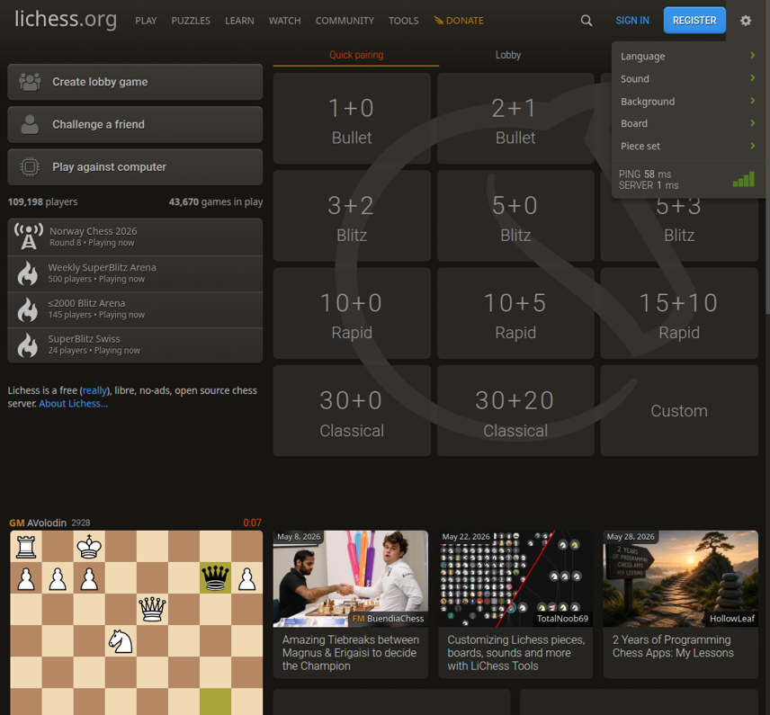
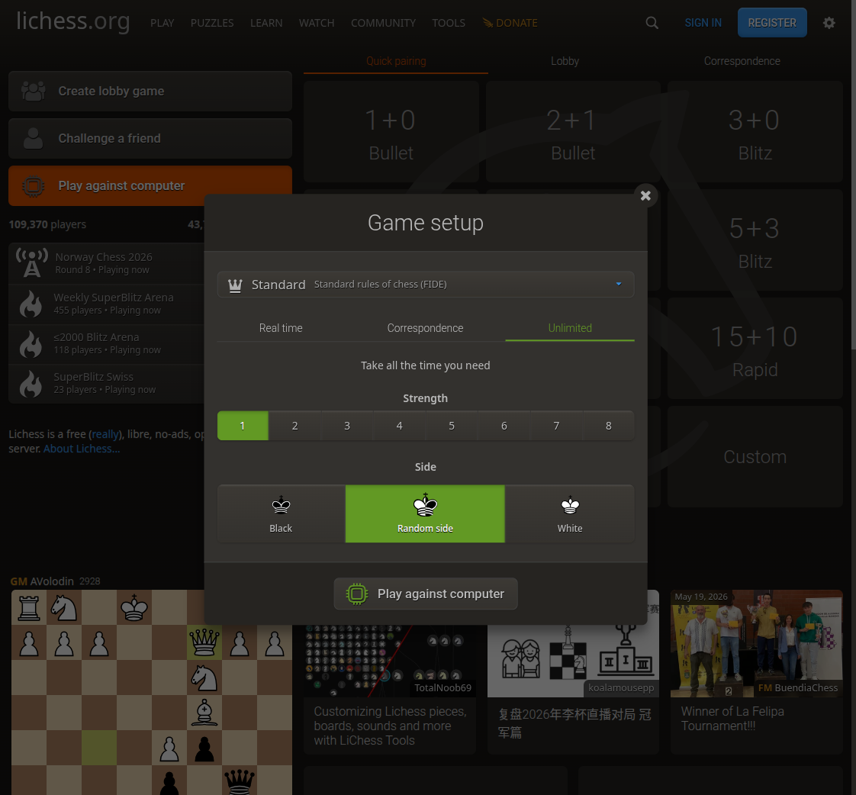
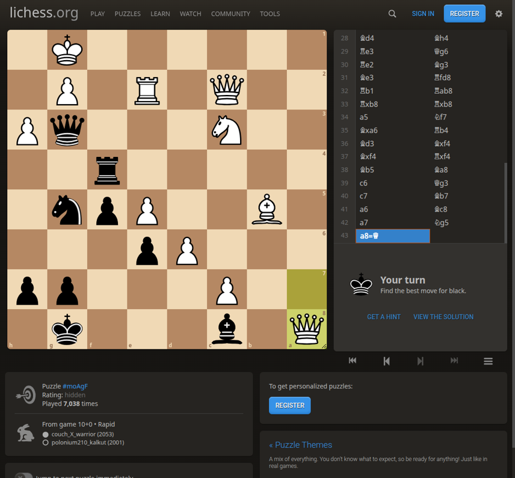
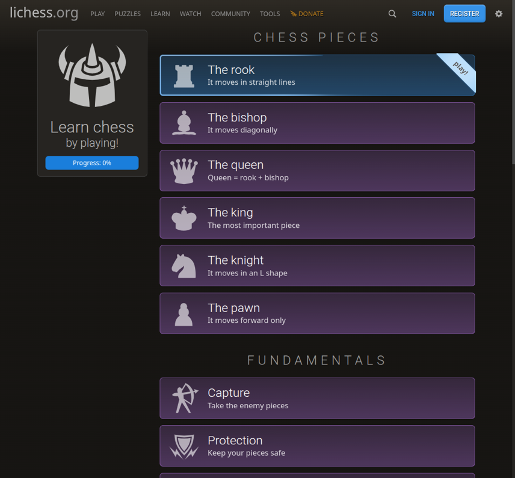
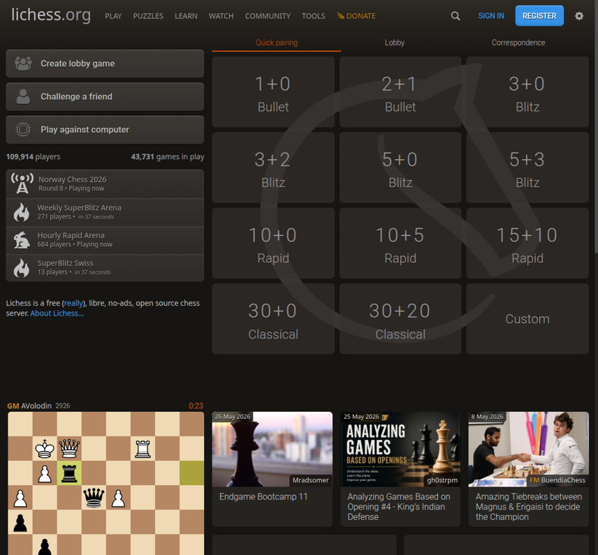
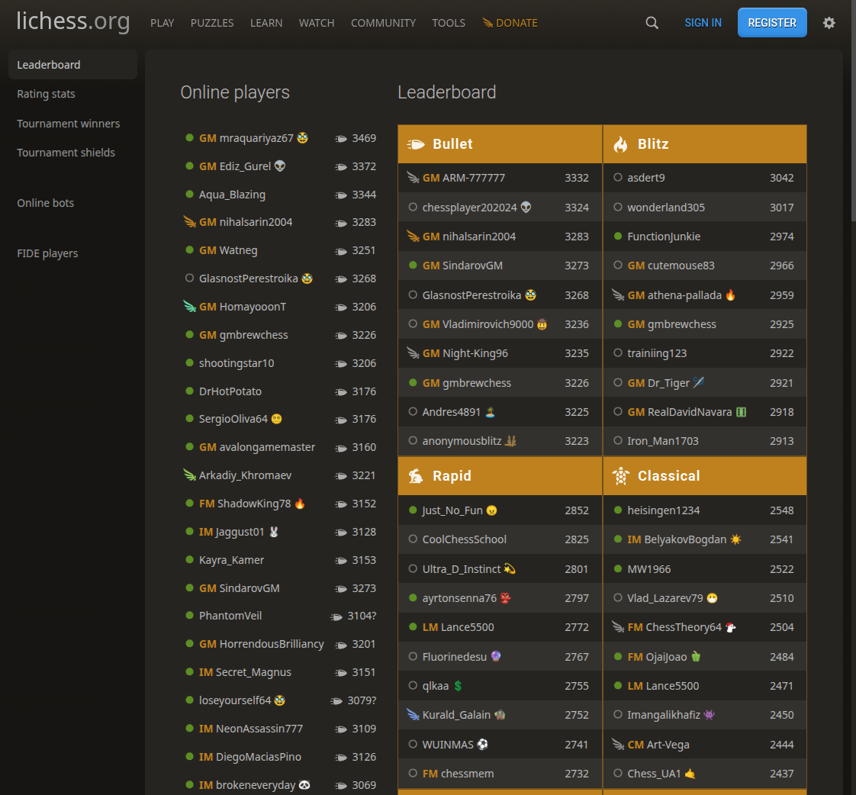
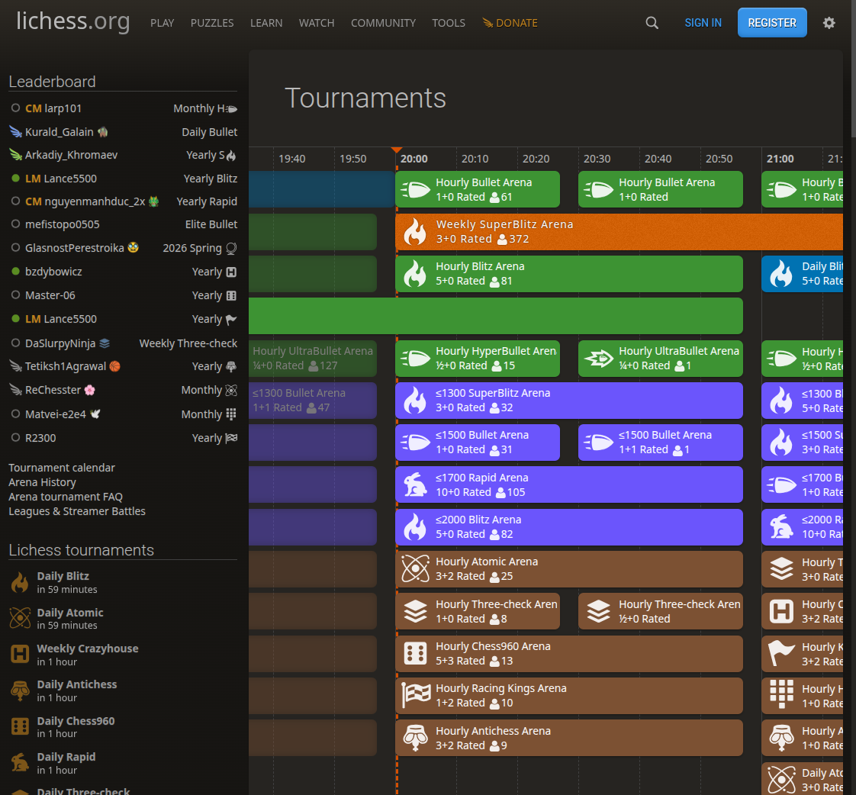
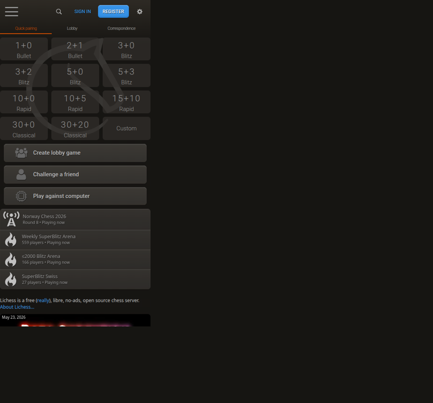

# Практическое задание 4
## Оценка интерфейса

**Тема проекта:** Веб-адаптация настольной игры на примере сервиса Lichess.org

**Дисциплина:** Экспертная оценка интерфейса и юзабилити  
**Институт:** Перспективных технологий и индустриального программирования (ИПТИП)  
**Кафедра:** Компьютерного дизайна (КД)  
**Преподаватель:** Мочалова Любовь Вадимовна  
**Семестр:** 6, 2025/2026 учебный год

---

## Цель работы

Провести экспертную оценку интерфейса веб-сервиса Lichess.org по критериям, сформулированным в практической работе №3, выполнить типовые пользовательские сценарии, зафиксировать результаты количественно (по шкале 1–5) и качественно, сформулировать выводы и рекомендации по улучшению.

---

## Связь с предыдущими практическими работами

В практической работе №2 был выполнен анализ интерфейса Lichess.org, описана целевая аудитория (новички, любители, энтузиасты, соревновательные и профессиональные игроки) и контекст использования (десктоп, мобильные устройства, домашняя/учебная среда). В практической работе №3 на этой основе были определены десять критериев экспертной оценки и составлен чек-лист из десяти пунктов. Текущая работа применяет эти инструменты на практике.

---

## Методика проведения оценки

Оценка проводилась методом эвристической экспертизы (single expert review). Эксперт работал с сайтом Lichess.org в десктопном браузере (Chromium-based), последовательно открывая основные разделы и выполняя типовые пользовательские сценарии. В ходе работы:

- поэтапно открывались ключевые страницы сервиса (главная, задачи, обучение, анализ, турниры, сообщество, ТВ, диалог игры с компьютером);
- делались скриншоты экранов средствами браузера для последующего анализа и фиксации замечаний;
- проверялась адаптивность интерфейса с помощью встроенного режима эмуляции мобильного устройства в DevTools (разрешение 390×844, типовой смартфон);
- оценивалась производительность сайта по ощущению скорости отклика, индикаторам PING / SERVER в выпадающем меню Preferences и показателям, доступным во вкладке «Network» инструментов разработчика (TTFB, First Contentful Paint, DOMContentLoaded, Load).

Каждый критерий оценивался по шкале от 1 (плохо) до 5 (отлично) с письменным обоснованием на основе личных наблюдений эксперта и зафиксированных показателей.

---

## Выполненные пользовательские сценарии

### С1. Запуск быстрой партии без регистрации
Главная → выбор контроля времени (5+0 Blitz) одним кликом → инициируется поиск соперника. Также проверена ветка «Сыграть с компьютером»: вызывается модальное окно «Game setup» с выбором уровня (1–8) и стороны (Black/Random/White).

### С2. Решение тактической задачи
Меню «Puzzles» / переход на /training. Сразу загружается случайная позиция, указано, чей ход, доступны кнопки «Get a hint» и «View the solution».

### С3. Прохождение интерактивного урока
Меню «Learn» / переход на /learn. Карточки уроков сгруппированы по разделам «Chess pieces», «Fundamentals», «Intermediate», «Advanced». Прогресс-бар отображает процент пройденного.

### С4. Анализ партии
Меню «Tools» → «Analysis board» (/analysis). Открывается доска и боковая панель движка Stockfish 18 (NNUE, локально в браузере). Доступны поля FEN/PGN.

### С5. Просмотр турниров
Меню «Play» → /tournament. Лента турниров выведена в виде Gantt-подобной шкалы времени с цветовым кодированием по типу (Bullet, Blitz, Rapid, Classical, вариативные шахматы). Параллельно отображается лидерборд.

### С6. Сообщество
Меню «Community» → /player. Колонки лидеров по форматам (Bullet, Blitz, Rapid, Classical), список online-игроков, разделы Tournament winners, FIDE players.

### С7. Просмотр живых партий
Меню «Watch» → /tv. Воспроизводится топ-партия в реальном времени с таймерами, нотацией, табло сыгранных и ссылками на анализ.

### С8. Адаптивность
Включён режим эмуляции мобильного устройства в DevTools (390×844). Горизонтальное меню сворачивается в бургер, сетка контролей времени перестраивается в три колонки, порядок элементов сохраняет логику.

### С9. Производительность
По данным вкладки «Network» инструментов разработчика, главная страница загружается с показателями: TTFB ≈ 299 мс, First Contentful Paint ≈ 481 мс, DOMContentLoaded ≈ 457 мс, Load ≈ 466 мс. В выпадающем меню Preferences отображаются индикаторы PING ≈ 58 мс и SERVER ≈ 1 мс.

---

## Иллюстрации (скриншоты ключевых экранов)

### Рисунок 1 — Главная страница: сетка контролей времени, боковая панель с турнирами, лента блогов и партия дня.

### Рисунок 2 — Диалог «Game setup» при запуске партии с компьютером: уровень 1–8 и выбор стороны.

### Рисунок 3 — Тактические задачи: позиция, нотация, подсказки «Get a hint» и «View the solution».

### Рисунок 4 — Раздел «Learn»: карточки уроков с иконками и прогресс-баром «Progress: 0%».

### Рисунок 5 — «Analysis board»: доска, движок Stockfish 18 (локально), поля FEN/PGN.

### Рисунок 6 — Турниры: лента в виде временной шкалы с цветовым кодированием по типу.

### Рисунок 7 — Сообщество / лидеры: колонки рейтингов по форматам и список online-игроков.

### Рисунок 8 — Lichess TV: live-партия топ-игроков, таймеры, счёт сыгранных партий.

### Рисунок 9 — Меню «Preferences» с быстрыми настройками (Language, Sound, Background, Board, Piece set) и индикаторами PING/SERVER.

### Рисунок 10 — Мобильный вид (390×844): бургер-меню, сетка контролей в три колонки, сохранён порядок элементов.

---

## Чек-лист экспертной оценки

| № | Пункт чек-листа | Статус | Комментарий |
|---|-----------------|--------|------------|
| 1 | Понятно, как начать новую игру | ✓ | Сетка «Quick pairing» на главной. Запуск — один клик. |
| 2 | Легко найти раздел обучения | ✓ | Пункт «Learn» в верхнем меню; карточки уроков с иконками. |
| 3 | Навигация между страницами не вызывает затруднений | ✓ | Глобальное меню фиксировано, разделы стабильны, заголовки совпадают с URL. |
| 4 | Анализ партии открывается быстро и понятно | ✓ | /analysis открывается ≈0,5 с, движок Stockfish сразу доступен локально. |
| 5 | Интерфейс не перегружен лишними элементами | ✓ | Минималистичный layout; реклама отсутствует. |
| 6 | Шахматная доска хорошо читается | ✓ | Контрастные клетки, координаты по краям, подсветка ходов. |
| 7 | Сайт быстро реагирует на действия пользователя | ✓ | Страницы открываются практически мгновенно; индикаторы PING/SERVER в Preferences подтверждают низкие задержки. |
| 8 | Сайт удобно использовать на мобильных устройствах | ✓ | Бургер-меню, перестроение сетки, сохранение порядка действий. |
| 9 | Прогресс обучения отображается наглядно | ≈ | Прогресс-бар «Progress: 0%» виден; полное сохранение прогресса требует регистрации (для гостя сбрасывается при выходе). |
| 10 | Пользователь может быстро участвовать в турнирах | ✓ | Список текущих турниров на главной + раздел /tournament с временной шкалой. |

**Условные обозначения:** ✓ — критерий выполнен, ≈ — выполнен с замечанием, ✗ — не выполнен.

---

## Оценка по 10 критериям (шкала 1–5)

| № | Критерий | Оценка | Обоснование |
|---|----------|--------|-------------|
| 1 | Ясность и понятность | 5 | Назначение основных элементов считывается мгновенно: сетка контролей времени, кнопки «Create lobby game», «Challenge a friend», «Play against computer». Иконки уроков (фигуры) и подписи в одну строку упрощают понимание. |
| 2 | Навигация | 5 | Глобальное меню (Play, Puzzles, Learn, Watch, Community, Tools, Donate) видимо на всех страницах. На мобильном — бургер с раскрытым деревом разделов. Все целевые страницы достигаются за 1–2 клика. |
| 3 | Эффективность | 5 | Запуск игры — 1 клик; партия с компьютером — 2 клика; тактическая задача и анализ — переход по разделу и сразу действие. Минимум промежуточных шагов. |
| 4 | Согласованность | 4 | Единый стиль: тёмный фон, фиолетовые акценты, зелёные CTA, одинаковые карточки. Лёгкое отклонение — Gantt-шкала на странице турниров и список Studies, выбивающиеся из карточной парадигмы. |
| 5 | Визуальный дизайн | 5 | Минималистичный тёмный интерфейс снижает нагрузку на глаза. Доска тёплых тонов с зелёной подсветкой ходов хорошо читается. Отсутствие рекламы и баннеров обеспечивает чистоту восприятия. |
| 6 | Отзывчивость | 5 | По данным вкладки «Network»: TTFB ≈ 299 мс, FCP ≈ 481 мс, DOMContentLoaded ≈ 457 мс, Load ≈ 466 мс. В Preferences видны PING ≈ 58 мс и SERVER ≈ 1 мс. Stockfish работает в браузере, позиции переключаются без задержек. |
| 7 | Доступность | 4 | Кнопка «Accessibility — Enable blind mode» в самом начале страницы; корректные ARIA-роли (button/link/heading), хороший контраст. Замечания: часть управляющих иконок в навигации по партии без текстовых подписей; элементы Gantt-шкалы турниров мелкие; переключатель языка доступен только через Preferences. |
| 8 | Адаптивность | 5 | В режиме эмуляции мобильного устройства (390×844) горизонтальное меню сворачивается в бургер, сетка контролей перестраивается в 3 колонки, вспомогательные кнопки переносятся ниже доски. Структура сохраняет логику. |
| 9 | Поддержка обучения | 4 | Развитая структура «Learn / Practice / Coordinates / Study / Coaches / Video library». Карточки уроков с прогресс-баром и иконками. Минусы: сохранение прогресса требует регистрации; в Studies встречается несфокусированный пользовательский контент (например, «Minecraft = Chess?»), который перемешан с обучающими материалами. |
| 10 | Поддержка игрового процесса | 5 | Богатый набор форматов (Bullet, Blitz, Rapid, Classical, варианты), запуск партии в один клик, готовые контроль времени, поиск соперника, игра с другом и с компьютером, турниры (Arena, Swiss), Lichess TV, бесплатный анализ партии Stockfish, импорт PGN, редактор позиций. |

**Сумма баллов:** 47 из 50  
**Средняя оценка:** 4.7 из 5

---

## Сильные и слабые стороны интерфейса

### Сильные стороны:

- Быстрый запуск партии без регистрации (1–2 клика).
- Минималистичный тёмный интерфейс, отсутствие рекламы.
- Отличная производительность (FCP < 0,5 с, локальный Stockfish).
- Полноценная адаптивность под мобильные устройства.
- Богатый набор обучающих и аналитических инструментов.
- Видимая забота о доступности (отдельный режим для незрячих).

### Слабые стороны и зоны роста:

- Прогресс обучения для гостя не сохраняется между сессиями.
- Контент пользовательских Studies перемешан с системными уроками и не всегда релевантен новичкам.
- Часть иконочных элементов (управление партией, Gantt-шкала турниров) не имеет текстовых подписей и может быть мелкой на маленьких экранах.
- Переключатель языка не вынесен наружу — только внутри меню Preferences.
- Большая плотность информации на странице турниров может перегружать новичка.

---

## Рекомендации по улучшению

1. **Сохранять прогресс обучения для гостя локально** (localStorage) с предложением «перенести в аккаунт» при регистрации — это снизит барьер входа для новичков.

2. **Разделить раздел «Studies»** на «Официальные / рекомендованные курсы» и «Пользовательский контент», добавить фильтр по уровню (новичок / средний / продвинутый).

3. **Добавить текстовые подписи** (или видимые tooltips) к иконочным кнопкам управления партией и навигации по ходам — это улучшит доступность.

4. **Вынести переключатель языка в шапку** (рядом с поиском) — сейчас он скрыт в выпадающем меню Preferences, что не очевидно для новых пользователей.

5. **Для страницы /tournament предусмотреть упрощённый режим** «карточки» в дополнение к Gantt-шкале — это снизит когнитивную нагрузку для новичков.

6. **На мобильной версии увеличить целевые области тапа** для элементов Gantt-шкалы турниров и истории ходов в анализе.

---

## Вывод

Экспертная оценка интерфейса Lichess.org по десяти критериям, заданным в практической работе №3, показала высокий уровень качества интерфейса: **средняя оценка составила 4.7 из 5**. Все десять пунктов чек-листа выполнены, один из них («Прогресс обучения») — с замечанием. 

Наиболее сильные стороны сервиса — отзывчивость (FCP < 0,5 с), эффективность ключевых сценариев (партия в 1–2 клика), визуальный минимализм без рекламы и развитая адаптивность. Зоны роста сосредоточены вокруг поддержки обучения для незарегистрированных пользователей и доступности части иконочных элементов. 

Сформулированы шесть конкретных рекомендаций, реализация которых позволит повысить юзабилити для целевой аудитории — особенно для сегментов «Новички» и «Любители», описанных в практической работе №2.

---

*Дата выполнения: 2026*
